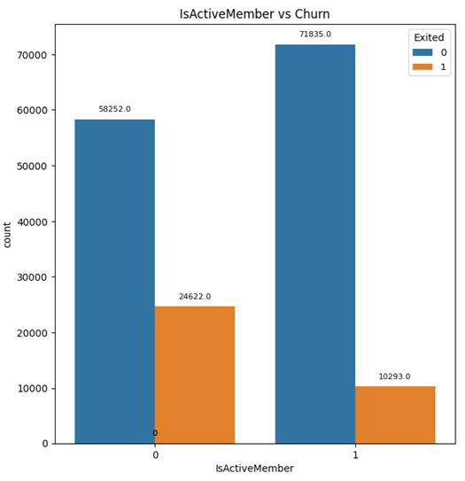
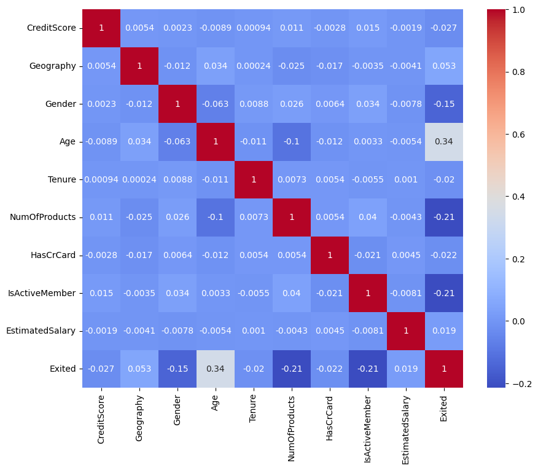
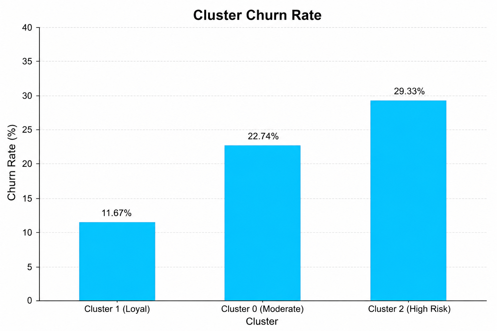
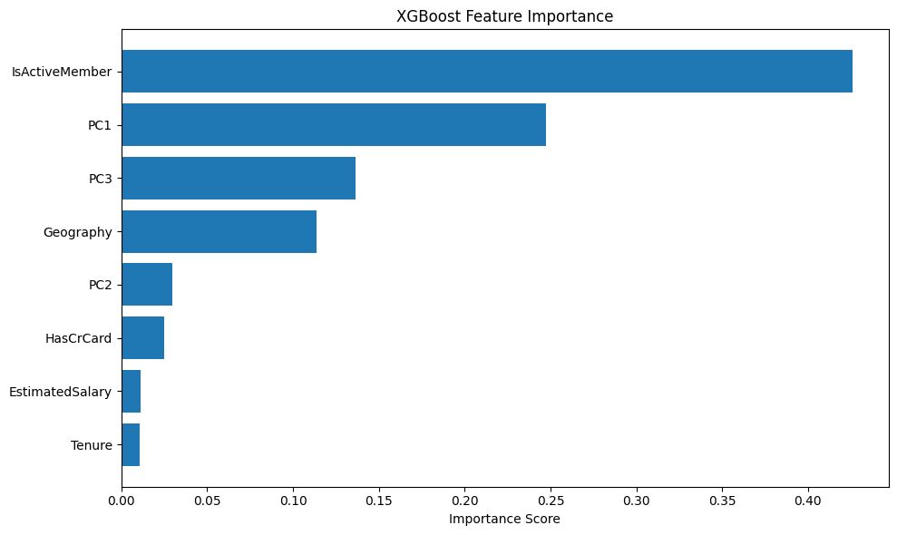
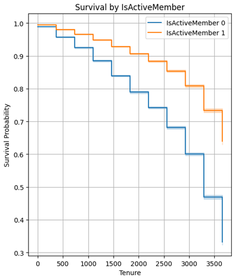

# 🏦 ChurnLens: Analysing and Predicting Customer Attrition

> A complete end-to-end data analysis project to understand, predict, and segment bank customers based on churn behaviour using statistical techniques and machine learning.

---

## 📌 Project Overview

Customer churn is one of the most critical challenges in the banking industry. Losing a customer not only means lost revenue but also the cost of acquiring a new one — which is significantly higher than retaining an existing one.

**ChurnLens** is an M.Sc. Statistics final year project that builds a full analytical pipeline on a real-world bank customer dataset to:
- Uncover patterns and factors driving customer churn
- Predict which customers are likely to leave
- Segment customers by churn risk using clustering
- Analyse *when* customers tend to leave using survival analysis

---

## 🎯 Objectives

- Examine the distribution of independent variables and assess normality
- Uncover patterns through Exploratory Data Analysis (EDA)
- Address multicollinearity using Principal Component Analysis (PCA)
- Build and evaluate predictive models (Logistic Regression & XGBoost)
- Segment customers using K-Means Clustering
- Analyse survival patterns using Kaplan-Meier estimation and Log-Rank tests

---

## 📂 Repository Structure

```
ChurnLens/
│
├── data/
│   └── train.csv                  # Raw dataset from Kaggle
│
├── notebooks/
│   ├── 01_Pre_Processing.ipynb     # Data cleaning & transformation
│   ├── 02_EDA.ipynb               # Exploratory Data Analysis
│   ├── 03_Multivariate_Analysis.ipynb      # PCA, Logistic Regression, XGBoost, Clustering
│   └── 04_Survival_Analysis.ipynb # Kaplan-Meier & Log-Rank tests
│
├── report/
│   └── ChurnLens_Report.pdf       # Full M.Sc. project report
│
├── requirements.txt               # Python dependencies
└── README.md
```

---

## 📊 Dataset

- **Source:** [Kaggle — Bank Churn Dataset](https://www.kaggle.com/datasets/rangalamahesh/bank-churn/data?select=train.csv)
- **Size:** 165,034 rows × 14 columns
- **Target Variable:** `Exited` (1 = Churned, 0 = Retained)

| Feature | Description |
|---|---|
| `CreditScore` | Customer's credit score (350–850) |
| `Geography` | Country — France, Germany, Spain |
| `Gender` | Male / Female |
| `Age` | Customer age in years |
| `Tenure` | Years with the bank |
| `Balance` | Bank account balance |
| `NumOfProducts` | Number of bank products used (1–4) |
| `HasCrCard` | Owns a credit card (0/1) |
| `IsActiveMember` | Active account usage (0/1) |
| `EstimatedSalary` | Estimated annual salary |
| `Exited` | Churned or not (target) |

---

## 🔧 Data Pre-processing

Key steps performed:

- Removed irrelevant columns (`id`, `Surname`)
- Checked and removed **30 duplicate entries**
- No missing values found in the dataset
- Converted `Tenure` from years to days for granular analysis
- Dropped invalid age entries 36.44 and 32.34 
- Validated data ranges (credit score, age, binary flags)
- Encoded categorical variables numerically
- Retained domain-valid outliers in `Age` and `CreditScore`
- Applied **Box-Cox transformation** (λ = −0.246) on `Age` to correct right skew
- Dropped `Balance` column due to 80,000+ zero values (low informational value)

---

## 🔍 Key Findings

### EDA Insights

| Factor | Finding |
|---|---|
| **Age** | Older customers churn more (correlation = +0.34) |
| **IsActiveMember** | Inactive members churn far more (correlation = −0.21) |
| **NumOfProducts** | More products = lower churn; 4 products = very high churn |
| **Geography** | Germany has the highest churn rate |
| **Gender** | Female customers churn slightly more |
| **CreditScore / Salary** | Negligible impact on churn |


*Inactive members show significantly higher churn rate*


*Age (0.34) and IsActiveMember (−0.21) are the strongest correlates of churn*

### Customer Segments (K-Means, k=3)

| Cluster | Profile | Churn Rate |
|---|---|---|
| **Cluster 0** | Moderately engaged, no credit card | 22.74% |
| **Cluster 1** | Highly active, has credit card | 11.67% ✅ |
| **Cluster 2** | Inactive, has credit card | 29.33% ⚠️ |


*Cluster 2 (inactive members) carries the highest churn risk at 29.33%*

### Model Performance

| Model | Accuracy | Recall (Churners) | F1-Score |
|---|---|---|---|
| Logistic Regression (baseline) | 83% | 35% | 0.46 |
| Logistic Regression + SMOTE | 73% | 74% | 0.54 |
| **XGBoost** | **79%** | **79%** | **0.62** |

### Top Predictors (XGBoost Feature Importance)

| Feature | Importance Score |
|---|---|
| IsActiveMember | 0.426 |
| PC1 (Age + NumOfProducts) | 0.247 |
| PC3 (Gender) | 0.137 |
| Geography | 0.114 |


*IsActiveMember dominates with 42.6% importance score*

---

## 📈 Survival Analysis

- **Kaplan-Meier curves** showed gradual decline in customer retention as tenure increases
- **Inactive members** churn significantly faster than active ones
- **Germany (Geography 2)** shows the steepest survival curve decline
- **2–3 products** lead to the best long-term retention
- **Log-Rank tests** confirmed all categorical features significantly affect churn (p < 0.005), except NumOfProducts 3 vs 4 (p = 0.21)


*Active members (orange) survive significantly longer than inactive ones (blue)*

---

## 🛠️ Tech Stack

| Tool | Usage |
|---|---|
| **Python** | Core programming language |
| **pandas** | Data manipulation and cleaning |
| **NumPy** | Numerical computations |
| **matplotlib / seaborn** | Data visualization |
| **scikit-learn** | PCA, Logistic Regression, K-Means, preprocessing |
| **XGBoost** | Gradient boosting classifier |
| **imbalanced-learn** | SMOTE for class imbalance |
| **lifelines** | Kaplan-Meier & Log-Rank survival analysis |
| **statsmodels** | VIF calculation for multicollinearity |
| **scipy** | Box-Cox transformation |

---

## ⚙️ Setup & Installation

```bash
# 1. Clone the repository
git clone https://github.com/IamDataExplorer/ChurnLens.git
cd ChurnLens

# 2. Install dependencies
pip install -r requirements.txt

# 3. Download the dataset from Kaggle and place it in /data/train.csv

# 4. Run notebooks in order
jupyter notebook
```

### requirements.txt
```
pandas
numpy
matplotlib
seaborn
scikit-learn
xgboost
imbalanced-learn
lifelines
statsmodels
scipy
jupyter
```

---

## 📓 Datasets (cleaned)

You can directly use the processed datasets used in notebooks 2, 3 and 4 for further analysis:

| Dataset | Link |
|---|---|
| New_df | [View](https://drive.google.com/file/d/1QYJmRHgeu4TvhxykmOtwUV3TZGw4F8KM/view?usp=sharing) |
| df_with_pc | [View](https://drive.google.com/file/d/1XXroD_ZAOyUKhwDWnFkFUmGkGDQ-nnDp/view?usp=sharing) |
---

## 💡 Business Recommendations

Based on the analysis, banks can take the following actions:

1. **Target Cluster 2 (29% churn risk)** — Launch re-engagement campaigns for inactive credit card holders
2. **Cross-sell products** — Push single-product customers towards 2–3 product bundles
3. **Regional strategy for Germany** — Investigate service quality or competitive pressures specific to that market
4. **Loyalty programs for older customers** — Age is the strongest predictor; senior customers need tailored engagement
5. **Monitor inactivity signals** — Build early-warning systems based on `IsActiveMember` status

---

## 📜 Academic Details

| | |
|---|---|
| **Author** | Sohel Firoj Shaikh |
| **Degree** | M.Sc. Statistics — Semester IV |
| **Institution** | Government Vidarbha Institute of Science and Humanities (Autonomous), Amravati |
| **Academic Year** | 2024–25 |
| **Project Guide** | Mrs. Shubhangi Bhagat |
| **HoD** | Dr. Neeta W. Andure |

---

## 📄 License

This project is submitted as an academic requirement. The dataset is publicly available on Kaggle. Feel free to use the code for learning purposes with appropriate attribution.

---

> *"Retaining a customer is not just a business goal — it's a data problem waiting to be solved."*
